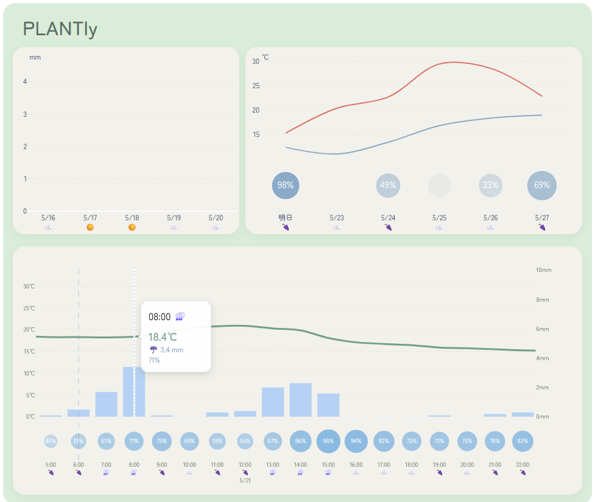

# Plantly 🌱
A plant

Plantly helps you decide:
- when to water plants
- how hot the next hours will be
- whether rain is coming
- UV risk for plants care dashboard powered by weather forecasting.
---

## 🖼️ Screenshot

# 🌿 Features

- 🌦 Real-time weather data (Open-Meteo API)
- 📊 Hourly + daily interactive graphs
- 💧 Watering suggestion based on rainfall history
- 🌡 Temperature prediction for next 12 hours
- ☔ Rain forecast + probability visualization
- ⚡ UV risk indicator for plants
- 🔄 Auto-refresh every hour

## Built With

- [Open-Meteo](https://open-meteo.com/) - real-time weather API
- [Plotly](https://plotly.com/python/) - interactive graphs
- [Dash](https://dash.plotly.com/) - web dashboard framework
- [Pandas](https://pandas.pydata.org/) - data processing

Weather data by Open-Meteo.com
